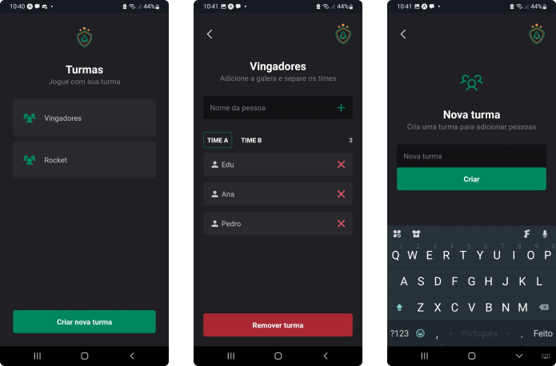

  <a href="#-technologies">Technologies</a>&nbsp;&nbsp;&nbsp;|&nbsp;&nbsp;&nbsp;
  <a href="#-project">Project</a>&nbsp;&nbsp;&nbsp;|&nbsp;&nbsp;&nbsp;
  <a href="#-layout">Layout</a>&nbsp;&nbsp;&nbsp;|&nbsp;&nbsp;&nbsp;
  <a href="#-how-to-run">How to Run</a>&nbsp;&nbsp;&nbsp;|&nbsp;&nbsp;&nbsp;

 

## ✨ Technologies

This project was developed using the following technologies:

- [React Native](https://reactnative.dev/)
- [TypeScript](https://www.typescriptlang.org/)
- [Expo](https://expo.dev/)
- [Styled Components](https://styled-components.com/)

## 💻 Project

Ignite Teams is a mobile application developed in the Rocketseat Ignite bootcamp using best practices in mobile development. It involves creating teams and adding players to teams. It does not have a database, so the data is stored on the device itself.

## 🔖 Layout

  

## 🚀 How to Run

- Clone the project repository
`git clone https://github.com/pedroh-cm/app-react-native-ignite-teams`
- Install dependencies with `npm install`
- Start the application with `npx expo start`
- With Expo Go open on your mobile device, scan the QR code in the terminal 
Note: Expo Go needs to be installed on your mobile device
